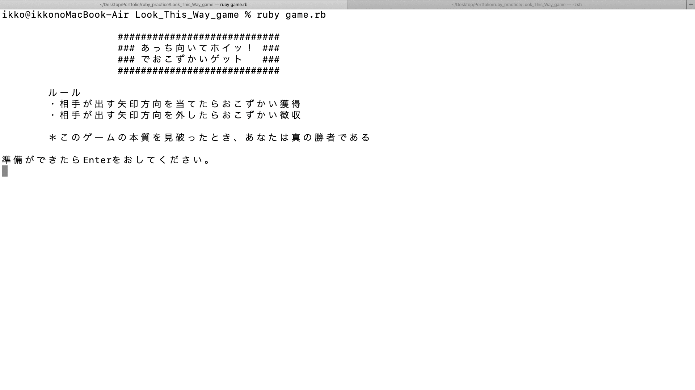

1. ゲームタイトル
***
    あっち、むいて、ホイっ！でおこずかいゲット

2. ゲーム説明
***
    a) 「ruby app.rb」でゲーム起動

    b) 「エンターキー」を押してゲーム開始

    c) 各矢印（h: "⇦", j: "⇩", k: "⇧", l: "⇨" ）に該当する英文字を入力

    d) 相手と一致したらあなたの勝ち

    e) 相手と一致しなかったらあなたの負け

    f) 続ける場合は、「y」を入力

    g) 終了する場合は、「n」を入力

    h) ゲームの本質を見破ったら、あなたは真の勝者

3. デモ
***
  

4. 使用技術
***
    Ruby

5. 作成者
***
[Ikko Tsuha](https://github.com/Ikko-T)

- Twitter: [@ikko1021](https://twitter.com/ikko1021)

- GitHub: [@Ikko-T](https://github.com/Ikko-T)

- Qiita: <a href="https://qiita.com/Ikko-T" rel="nofollow">@Ikko-T</a>

6. ライセンス
***
(C)Copyright 2020 Ikko Tsuha
<!--
〜〜〜〜〜〜〜〜〜〜〜〜〜〜〜〜〜〜〜〜〜〜〜〜〜〜〜〜〜〜〜〜〜〜〜〜〜〜〜

1. The title of this play

       Look This Way

2. Instructions

    a) Start off with "ruby app.rb" in terminal and hit "Enter".

    b) Select an alphabetical letter from 'h', 'j', 'k', or 'l' provided that represents an arrow respectively.

    c) You win if your selection matches the other; otherwise, you lose.

    d) Select 'y' if you would like to continue; otherwise, this play comes to an end.

3. Ruby version

    2.6.3p62
-->
